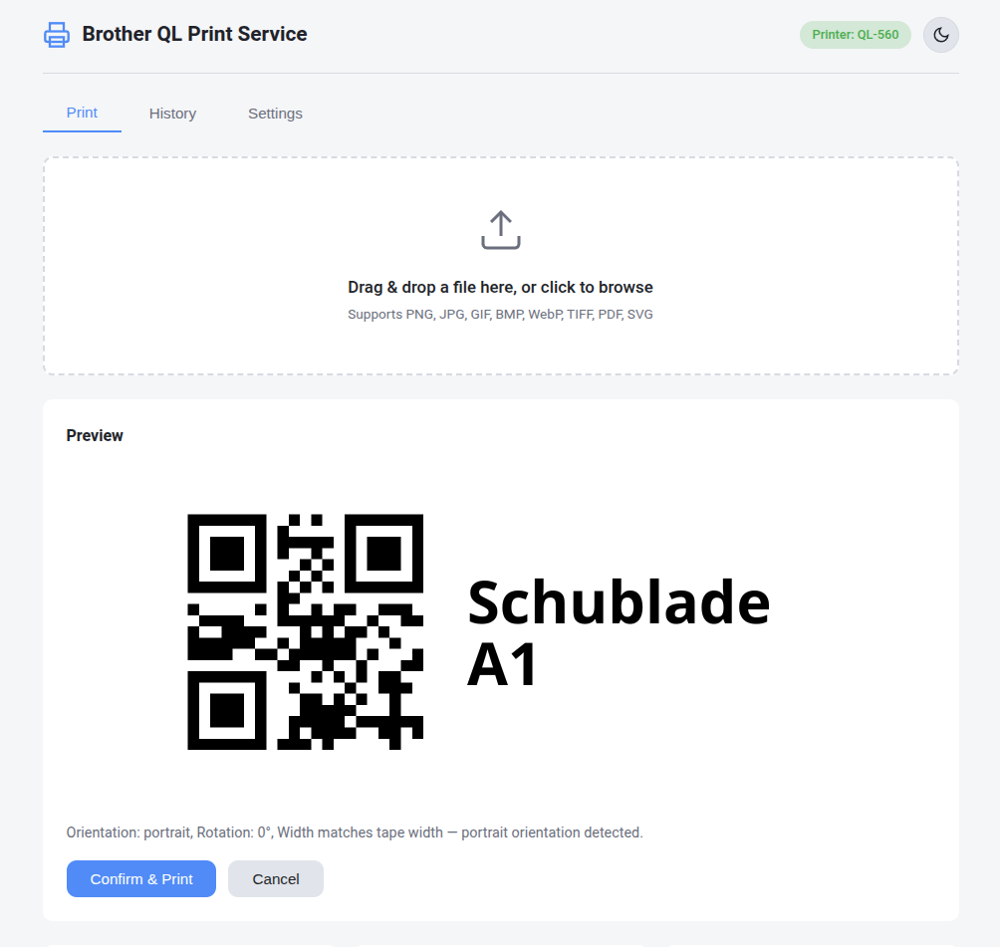

# Brother QL Print Service

A lightweight FastAPI-based web service for printing labels on Brother QL series label printers (e.g. QL-560). Provides a visual web UI for uploading images/PDFs/SVGs, previewing prints, managing a print queue, and configuring printer settings. Deployed via Docker Compose with local volume mounts.



## TLDR Install

```bash
# 1. Download config and Docker Compose templates
BASE=https://raw.githubusercontent.com/ulikoehler/BrotherQLLabelPrintService/master
curl -fsSL "$BASE/config.template.yaml" -o config.yaml
curl -fsSL "$BASE/docker-compose.template.yaml" -o docker-compose.yaml
mkdir -p data

# 2. Edit config.yaml — set your printer model, backend, identifier, and label
$EDITOR config.yaml

# 3. Edit docker-compose.yaml — uncomment the USB device section for your printer
$EDITOR docker-compose.yaml

# 4. Start the service
docker compose up -d

# 5. (Optional) Create a systemd service so it starts on boot
curl -fsSL https://techoverflow.net/scripts/create-docker-compose-service.sh | sudo bash /dev/stdin
```

The service is now available at `http://localhost:8080`.

> **Step 5** uses the [create-docker-compose-service script](https://techoverflow.net/2020/10/24/create-a-systemd-service-for-your-docker-compose-project-in-10-seconds/) to automatically create a systemd service that runs `docker compose up -d` on boot.

## Features

- **Web UI**: Drag-and-drop upload, server-side preview, print history, and settings — all in a clean, modern interface
- **Multi-format support**: PNG, JPG, JPEG, GIF, BMP, WebP, TIFF, PDF, and SVG
- **Auto-orientation**: Automatically detects portrait/landscape based on document dimensions vs. tape width
- **Print queue**: YAML-based persistent queue with status tracking (queued, printing, printed, failed)
- **Print history**: Last 100 prints with thumbnails and metadata
- **Comprehensive settings**: Printer model, backend, label type, tape width, rotation, threshold, dithering, compression, cut, quality, DPI, copies, preview toggle
- **Full REST API**: Every feature accessible programmatically
- **Docker deployment**: Single container with configurable USB device mapping
- **Resource-efficient**: FastAPI with limited workers for low memory footprint

## Quick Start

### Docker (Recommended)

#### Using the pre-built Docker Hub image

No need to clone the repo — just download the templates and start the service:

```bash
# Download the config template and Docker Compose template
BASE=https://raw.githubusercontent.com/ulikoehler/BrotherQLLabelPrintService/master
curl -fsSL "$BASE/config.template.yaml" -o config.yaml
curl -fsSL "$BASE/docker-compose.template.yaml" -o docker-compose.yaml

# Create the data directory
mkdir -p data

# Edit config.yaml to match your printer (model, backend, identifier, label)
$EDITOR config.yaml

# Start the service
docker compose up -d
```

If you've already cloned the repo, use the local templates instead:

```bash
cp config.template.yaml config.yaml
cp docker-compose.template.yaml docker-compose.yaml
$EDITOR config.yaml
docker compose up -d
```

The service will be available at `http://localhost:8080`.

Pre-built image: [ulikoehler/brotherql-label-print-service](https://hub.docker.com/r/ulikoehler/brotherql-label-print-service) on Docker Hub.

#### Building locally

```bash
cp config.template.yaml config.yaml
cp docker-compose.local_build.template.yaml docker-compose.yaml
$EDITOR config.yaml
docker compose up -d --build
```

#### Docker USB Access

Edit your `docker-compose.yaml` and uncomment/adjust the `devices` section for your setup:

**For `pyusb` backend** (recommended):
```yaml
devices:
  - /dev/bus/usb:/dev/bus/usb
```

**For `linux_kernel` backend**:
```yaml
devices:
  - /dev/usb/lp0:/dev/usb/lp0
```

**Or use privileged mode** (simplest, less secure):
```yaml
privileged: true
```

### Run Without Docker

#### Install system dependencies

**Debian/Ubuntu:**
```bash
sudo apt-get update
sudo apt-get install -y poppler-utils librsvg2-bin libusb-1.0-0 libglib2.0-0
```

**Arch Linux:**
```bash
sudo pacman -S poppler librsvg libusb glib2
```

**Fedora:**
```bash
sudo dnf install -y poppler-utils librsvg2 libusb1 glib2
```

#### Install Python dependencies

```bash
python3 -m venv .venv
source .venv/bin/activate
pip install -r requirements.txt
```

#### Configure

```bash
cp config.template.yaml config.yaml
```

Edit `config.yaml` to match your printer model and connection. Also change the Docker-only `/data` paths to a local directory:

```yaml
storage:
  data_dir: "./data"
  queue_file: "./data/queue.yaml"
```

#### Create the data directory

```bash
mkdir -p data/uploads data/prints data/previews
```

#### Run the server

```bash
uvicorn app.main:app --host 0.0.0.0 --port 8080 --workers 2
```

The service will be available at `http://localhost:8080`.

## Configuration

All settings are in `config.yaml` (see `config.template.yaml` for annotated options):

| Section | Key | Description | Default |
|---------|-----|-------------|---------|
| `printer.model` | Printer model | QL-560, QL-710W, etc. | `QL-560` |
| `printer.backend` | Connection backend | `pyusb`, `linux_kernel`, `network` | `pyusb` |
| `printer.identifier` | Printer address | `usb://04f9:2027`, `/dev/usb/lp0`, `tcp://host:9100` | `usb://04f9:2027` |
| `printer.label` | Label type | `62`, `62x29`, `62x100`, etc. | `62` |
| `printing.tape_width_mm` | Tape width in mm | 12, 29, 38, 50, 54, 62, 102, 103 | `62` |
| `printing.rotate` | Default rotation | `auto`, `0`, `90`, `180`, `270` | `auto` |
| `printing.threshold` | B/W threshold (%) | 0–100 | `70` |
| `printing.dither` | Dithering | `true`/`false` | `false` |
| `printing.compress` | Compression | `true`/`false` | `false` |
| `printing.cut` | Cut after print | `true`/`false` | `true` |
| `printing.hq` | High quality | `true`/`false` | `true` |
| `printing.dpi_600` | 600 dpi mode | `true`/`false` | `false` |
| `printing.copies` | Default copies | 1–99 | `1` |
| `ui.show_preview` | Preview before print | `true`/`false` | `true` |
| `ui.max_history` | Max history entries | 10–1000 | `100` |

## Print Orientation Logic

The service automatically determines print orientation based on the document dimensions and the configured tape width:

1. **Width matches tape width** (e.g. 62mm): Portrait orientation, no rotation. The image is printed as-is.
2. **Height matches tape width** (e.g. 62mm): Landscape orientation, rotated 90°. Used for large labels like 62×140mm.
3. **Neither dimension matches**: The service **refuses** to print unless:
   - An explicit `orientation` is provided (`portrait` or `landscape`), **and**
   - `resize=true` is set

This prevents accidental misprints on labels with non-standard dimensions.

> **See also**: [Processing Pipeline](docs/Pipeline.md) for a detailed step-by-step description of the entire pipeline from upload to print, including all conditionals, intermediate files, and configuration options.

### Tape Width → Pixel Mapping

| Tape Width (mm) | Printable Pixels (at 300dpi) |
|-----------------|---------------------------|
| 12 | 106 |
| 29 | 306 |
| 38 | 413 |
| 50 | 554 |
| 54 | 590 |
| **62** | **696** |
| 102 | 1164 |
| 103 | 1200 |

## Print Queue

The print queue is stored as a YAML file (`data/queue.yaml`) containing a list of entries:

```yaml
- id: "uuid-string"
  original_filename: "label.pdf"
  stored_filename: "/data/prints/print_uuid.png"
  timestamp: "2024-01-15T12:30:00+00:00"
  status: "printed"  # queued | printing | printed | failed
  label: "62"
  rotation: 90
  copies: 1
  orientation: "landscape"
  width_mm: 140.0
  height_mm: 62.0
  error_message: ""
  preview_filename: "uuid.png"
```

Jobs are processed sequentially in the background. The queue persists across restarts.

## REST API

### Endpoints

| Method | Path | Description |
|--------|------|-------------|
| `POST` | `/api/upload` | Upload a file for printing |
| `POST` | `/api/preview` | Generate a preview image |
| `GET` | `/api/preview/{id}` | Retrieve a preview PNG |
| `POST` | `/api/print` | Add a file to the print queue |
| `GET` | `/api/queue` | List print history |
| `DELETE` | `/api/queue/{id}` | Remove a queue item |
| `GET` | `/api/settings` | Get current settings |
| `PUT` | `/api/settings` | Update settings |
| `GET` | `/api/printer/status` | Query printer status |
| `GET` | `/api/labels` | List available label types |
| `GET` | `/api/models` | List supported printer models |
| `GET` | `/api/discover` | Discover connected printers |
| `GET` | `/api/files/{filename}` | Serve a file (preview/print) |

### API Documentation

Interactive API docs (Swagger UI) available at `http://localhost:8080/docs`.

ReDoc available at `http://localhost:8080/redoc`.

### Examples

#### Upload a File

**curl:**
```bash
curl -X POST http://localhost:8080/api/upload \
  -F "file=@label.pdf"
```

**Python (requests):**
```python
import requests

with open("label.pdf", "rb") as f:
    response = requests.post(
        "http://localhost:8080/api/upload",
        files={"file": f},
    )
data = response.json()
file_id = data["file_id"]
print(f"File uploaded: {data['dimensions_mm']} mm, orientation: {data['orientation']}")
```

#### Generate a Preview

**curl:**
```bash
curl -X POST http://localhost:8080/api/preview \
  -H "Content-Type: application/json" \
  -d '{"file_id": "FILE_ID_FROM_UPLOAD"}'
```

**Python:**
```python
import requests

response = requests.post(
    "http://localhost:8080/api/preview",
    json={"file_id": file_id},
)
preview = response.json()
print(f"Preview URL: {preview['preview_url']}")
print(f"Orientation: {preview['orientation']}, Rotation: {preview['rotation']}")
```

#### Print a File

**curl:**
```bash
# Auto-orientation (when dimension matches tape width)
curl -X POST http://localhost:8080/api/print \
  -H "Content-Type: application/json" \
  -d '{"file_id": "FILE_ID", "copies": 1}'

# Manual orientation with resize (when dimensions don't match)
curl -X POST http://localhost:8080/api/print \
  -H "Content-Type: application/json" \
  -d '{"file_id": "FILE_ID", "orientation": "landscape", "resize": true, "copies": 2}'
```

**Python:**
```python
import requests

# Auto-orientation
response = requests.post(
    "http://localhost:8080/api/print",
    json={"file_id": file_id, "copies": 1},
)
print(response.json())

# Manual orientation with resize
response = requests.post(
    "http://localhost:8080/api/print",
    json={
        "file_id": file_id,
        "orientation": "landscape",
        "resize": True,
        "copies": 2,
    },
)
print(response.json())
```

#### List Print History

**curl:**
```bash
curl http://localhost:8080/api/queue
```

**Python:**
```python
import requests

response = requests.get("http://localhost:8080/api/queue")
for item in response.json():
    print(f"{item['original_filename']} — {item['status']} — {item['timestamp']}")
```

#### Get and Update Settings

**curl:**
```bash
# Get settings
curl http://localhost:8080/api/settings

# Update settings
curl -X PUT http://localhost:8080/api/settings \
  -H "Content-Type: application/json" \
  -d '{"printing": {"threshold": 80, "dither": true}}'
```

**Python:**
```python
import requests

# Get
response = requests.get("http://localhost:8080/api/settings")
print(response.json())

# Update
response = requests.put(
    "http://localhost:8080/api/settings",
    json={"printing": {"threshold": 80, "dither": True}},
)
print(response.json())
```

#### Check Printer Status

**curl:**
```bash
curl http://localhost:8080/api/printer/status
```

**Python:**
```python
import requests

response = requests.get("http://localhost:8080/api/printer/status")
print(response.json())
```

#### Discover Printers

**curl:**
```bash
curl http://localhost:8080/api/discover
```

**Python:**
```python
import requests

response = requests.get("http://localhost:8080/api/discover")
print(response.json())
```

#### Remove a Queue Item

**curl:**
```bash
curl -X DELETE http://localhost:8080/api/queue/ITEM_ID
```

**Python:**
```python
import requests

response = requests.delete(f"http://localhost:8080/api/queue/{item_id}")
print(response.json())
```

### Full Print Workflow (Python)

```python
import requests

BASE = "http://localhost:8080"

# 1. Upload
with open("label.pdf", "rb") as f:
    resp = requests.post(f"{BASE}/api/upload", files={"file": f})
file_id = resp.json()["file_id"]

# 2. Preview (optional)
resp = requests.post(f"{BASE}/api/preview", json={"file_id": file_id})
preview = resp.json()
print(f"Preview: {preview['preview_url']}")

# 3. Print
resp = requests.post(f"{BASE}/api/print", json={"file_id": file_id, "copies": 1})
print(f"Job status: {resp.json()['status']}")

# 4. Check history
resp = requests.get(f"{BASE}/api/queue")
for item in resp.json():
    print(f"  {item['original_filename']}: {item['status']}")
```

## Project Structure

```
BrotherQLPrint/
├── docker-compose.template.yaml          # Docker Compose template (pre-built image)
├── docker-compose.local_build.template.yaml  # Docker Compose template (local build)
├── docker-compose.yaml                   # Actual compose file (copied from template, gitignored)
├── Dockerfile                            # Container image definition
├── publish-docker.sh                     # Script to build & push image to Docker Hub
├── config.template.yaml                  # Annotated config template
├── config.yaml                           # Actual configuration (gitignored)
├── requirements.txt                      # Python dependencies
├── README.md                             # This file
├── docs/
│   └── Pipeline.md                       # Detailed processing pipeline documentation
├── app/
│   ├── __init__.py
│   ├── main.py              # FastAPI application with all endpoints
│   ├── config.py            # YAML config loading, validation, defaults
│   ├── converter.py         # PDF/SVG/image → PNG conversion + dimension detection
│   ├── printer.py           # brother_ql_next API wrapper + orientation logic
│   ├── queue.py             # YAML-based print queue management
│   └── static/
│       ├── index.html       # Single-page web UI
│       ├── style.css        # Dark theme styling
│       └── app.js           # Frontend logic
└── data/                    # Docker volume (uploads, prints, previews, queue.yaml)
    ├── uploads/
    ├── prints/
    ├── previews/
    └── queue.yaml
```

## Dependencies

### Python packages
- `fastapi` — Web framework
- `uvicorn[standard]` — ASGI server
- `pyyaml` — Config and queue file format
- `pillow` — Image processing
- `brother_ql_next` — Brother QL printer communication
- `python-multipart` — File upload support

### System packages (in Docker)
- `poppler-utils` — `pdftoppm` for PDF → PNG conversion
- `librsvg2-bin` — `rsvg-convert` for SVG → PNG conversion
- `libusb-1.0-0` — USB access for pyusb backend

## Supported Printers

Uses [brother_ql_next](https://github.com/LunarEclipse363/brother_ql_next) which supports:

- QL-500, QL-550, QL-560, QL-570, QL-580N
- QL-600, QL-650TD
- QL-700, QL-710W, QL-720NW
- QL-800, QL-810W, QL-820NWB
- QL-1050, QL-1060N
- QL-1100, QL-1100NWB, QL-1110NWB, QL-1115NWB

## License

This project is licensed under the GPL-3.0 license (inheriting from brother_ql_next).
